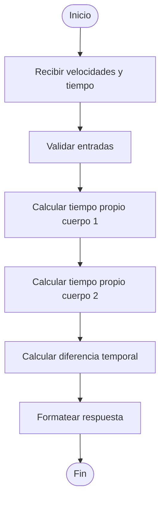

# Documentación Técnica.

## Introducción

La calculadora del tiempo relativista es una herramienta que permite calcular la diferencia temporal entre dos cuerpos que viajan a diferentes velocidades durante un tiempo de referencia (el tiempo de viaje). El objetivo es mostrar cómo el tiempo propio de cada cuerpo varía según los postulados de la relatividad especial, en particular mediante el uso del factor de Lorentz.

## Flujo del Proceso

### Frontend (Angular)

1. El usuario ingresa:
   - Velocidad del cuerpo 1.
   - Velocidad del cuerpo 2.
   - Tiempo de referencia (en segundos, desde el sistema inercial).
2. El frontend estructura estos datos (convierte la velocidades a $$m/s$$) y realiza una solicitud HTTP `POST` al endpoint expuesto por el backend.
3. Una vez obtenida la respuesta, muestra:
   - El tiempo propio de cada cuerpo.
   - La diferencia de tiempo entre ellos.

### Backend (FastAPI + Arquitectura Hexagonal)

1. **Entry Point (Adapter de API)**:
   - Endpoint `POST time/time-comparision`.
   - Recibe los datos como JSON.
   - Valida el rango de velocidades (v < c).
   - Convierte los datos al DTO de entrada.

2. **Use Case (Application Layer)**:
   - Orquesta el flujo del cálculo.
   - Aplica la fórmula de dilatación temporal:

     $$
     t' = t / sqrt(1 - v²/c²)
     $$

     donde:
     - `t` es el tiempo de referencia.
     - `v` es la velocidad relativa del cuerpo.
     - `c` es la velocidad de la luz (constante).
   - Calcula el tiempo propio para cada cuerpo.
   - Calcula la diferencia entre los dos tiempos.

3. **Domain Layer**:
   - Contiene la lógica pura de negocio: clase `RelativisticTimeCalculator`.
   - Métodos:
     - `calculate_proper_time(velocity: float, reference_time: float) -> float`
     - `calculate_difference(time1: float, time2: float) -> float`

4. **Response**:
   - El resultado se estructura en un DTO de salida y se retorna al cliente.

## Cálculos y Fórmulas Utilizadas[^1]

- **Factor de Lorentz**:  
$$
  \gamma = \frac{1}{\sqrt{1 - \frac{v^2}{c^2}}}
$$

- **Tiempo propio**:  
$$
  t' = \frac{t}{\gamma}
$$

- **Diferencia de tiempos**:  
$$
  \Delta t = |t'_1 - t'_2|
$$


## Diagrama de Flujo del Cálculo



## Consideraciones

- El sistema no contempla aceleraciones ni efectos gravitacionales (solo relatividad especial).
- La velocidad de la luz se asume constante en el sistema de unidades elegido.
- Puede ampliarse para incluir más cuerpos o representar visualmente las diferencias en una gráfica.

## Posibles Extensiones Futuras

- Soporte para efectos de relatividad general.
- Comparación entre múltiples cuerpos.
- Visualización gráfica de los tiempos en el frontend.

---


## Repositorio y Código Fuente

Todo el código fuente de este proyecto se encuentra disponible en GitHub. Para acceder a la implementación completa, incluyendo todos los detalles de configuración, puedes visitar el repositorio:

[Time-Calculator: Back](https://github.com/sasanchezramirez/time-back)

[Time-Calculator: Front](https://github.com/sasanchezramirez/time-front)


## Ejemplos de Código Clave

### Ejemplo 1: Cálculo del Tiempo Relativista (Domain)

```python
class RelativisticTimeCalculator:
    SPEED_OF_LIGHT = 299792458  # m/s

    def calculate_proper_time(self, velocity: float, reference_time: float) -> float:
        """Calcula el tiempo propio de un cuerpo en movimiento."""
        # Normalizar velocidad (v/c)
        normalized_velocity = velocity / self.SPEED_OF_LIGHT
        
        # Factor de Lorentz
        lorentz_factor = 1 / math.sqrt(1 - normalized_velocity**2)
        
        # Dilatación temporal
        proper_time = reference_time / lorentz_factor
        
        return proper_time
    
    def calculate_time_difference(self, time1: float, time2: float) -> float:
        """Calcula la diferencia absoluta entre dos tiempos propios."""
        return abs(time1 - time2)
```

### Ejemplo 2: DTO para la Respuesta

```python
class TimeCalculationResponseDTO:
    def __init__(
        self,
        proper_time_body1: float,
        proper_time_body2: float,
        time_difference: float
    ):
        self.proper_time_body1 = proper_time_body1
        self.proper_time_body2 = proper_time_body2
        self.time_difference = time_difference
        
    def to_dict(self):
        return {
            "proper_time_body1": self.proper_time_body1,
            "proper_time_body2": self.proper_time_body2,
            "time_difference": self.time_difference
        }
```

## Implementación y Detalles Técnicos

Para una comprensión completa de la implementación, se recomienda revisar el código fuente en el repositorio GitHub. Allí encontrarás:

- Implementación completa del frontend en Angular
- Código backend con arquitectura hexagonal
- Instrucciones detalladas de instalación y configuración

¿Tienes alguna sugerencia? Yo encantado de recibirla.

---

